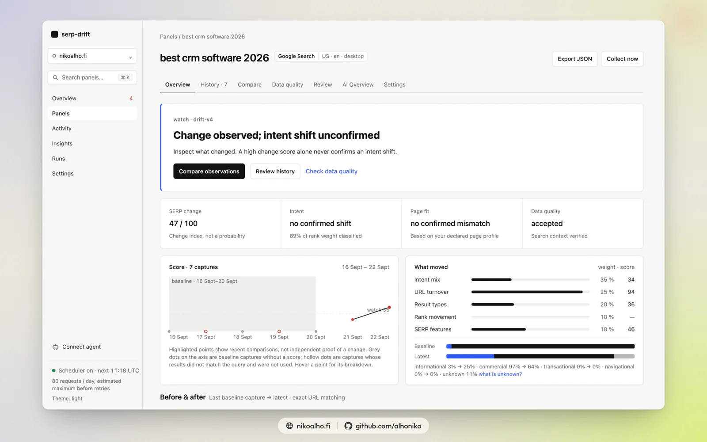
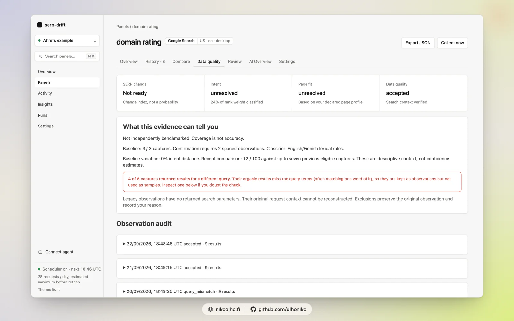

# serp-drift · SERP Intent Drift Monitor

Track when a search results page changes enough to deserve a content review. Google, Bing, YouTube, News, and Shopping results through [SearchApi](https://www.searchapi.io/?utm_source=dev&utm_medium=ambassador&utm_campaign=nikoalho.fi); SQLite history on your own machine; an explainable score that separates URL turnover, ranking moves, result types, SERP features, and estimated intent; AI Overview citations resolved to real URLs; a small app, a static report, a webhook, a digest, and an MCP server. Standard-library Python, no build step, no runtime dependencies.

<a href="https://www.searchapi.io/?utm_source=dev&utm_medium=ambassador&utm_campaign=nikoalho.fi"><picture><source media="(prefers-color-scheme: dark)" srcset="docs/assets/searchapi-logo-white.png"></picture></a>

[](https://github.com/alhoniko/serp-intent-drift/actions/workflows/check.yml)  

**0.6.0 beta (release candidate):** detects captures whose results do not match the query and keeps them out of the evidence, retries them, and bounds collection by a request cap and an end date. Built on 0.5's evidence quality, separate intent/page-fit decisions and review workflow. Classification accuracy has not yet been independently measured. See [the 0.6 release notes](docs/release-v06.md).

## Quickstart

```sh
# From a source checkout (the package is not yet published to PyPI):
uv tool install .
serp-drift init --dir ~/serp-drift        # first query, your page, and the API key (hidden input)
serp-drift --dir ~/serp-drift serve       # dashboard on http://127.0.0.1:8765, scheduler included
serp-drift --dir ~/serp-drift schedule --install   # keep it running at login (launchd / systemd)
```

No SearchApi account yet? Sign up at [searchapi.io](https://www.searchapi.io/?utm_source=dev&utm_medium=ambassador&utm_campaign=nikoalho.fi); the first live runs of this project cost one credit per search and one per expanded AI Overview. Want to look first? `serp-drift demo` renders a complete synthetic report without a key.

Prefer no server at all? Fork the repository, add one secret, and [GitHub Actions](docs/github-actions.md) collects daily and publishes the report to Pages.

## What you get

- **A change score with the working shown.** Intent mix 35 %, URL turnover 25 %, result types 20 %, rank movement 10 %, SERP features 10 %, against a fixed baseline using every eligible capture. Only a repeated intent or page-profile change can confirm a review. A ranking swap alone never becomes an intent alert.
- **History you can query.** Every capture, every URL's position over time, a change log between captures, and a compare tool for any two captures or date ranges with the same arithmetic as the alert.
- **AI Overviews with citations.** Deferred Overviews are expanded and their references resolved to real URLs, so you see which hosts Google cites and whether your page is among them.
- **Page fit.** Declare the intent your page serves, hand in a local export, or let the collector fetch the public HTML; the report compares the estimated SERP intent with that profile.
- **One app, one process.** Dashboard, panel views, insights across panels, panel management that edits `monitor.toml`, runs and events, a static export, a webhook with a digest, and `serp-drift mcp` for agents.
- **Review workflow.** Investigate a confirmed change, record an action and rationale, set a review date, and track its outcome. Notification deduplication follows the signal episode.
- **Data audit.** Retained search parameters, provider request IDs, quality quarantine, and reversible exclusions with reasons. A query-term check flags captures whose organic results do not contain the query (live data showed results for one word of the query); they stay stored but never count as evidence. Older observations remain explicitly unverified.
- **Honest limits.** Intent comes from English and Finnish lexical rules (add a language with one TOML file, or an optional LLM for the gaps). Coverage is shown on every capture; unknowns cannot trigger a page-fit alert.





Screenshots show 0.6.0 with live data captured on 22 September 2026; they are not live statistics. More views, captions and the reproducible capture and composition tools are in [the media kit](docs/media/MEDIA-KIT.md).

## Run the demo

Use Python 3.11+ on Linux, macOS, or WSL. From a checkout:

```sh
python3 -m serp_drift demo
python3 -m serp_drift serve --static reports/demo
```

The demo contains four queries and 24 invented snapshots covering an informational → commercial shift, a small ranking swap, URL and feature churn, and a sparse capture. All result URLs use reserved `.example` domains; nothing in it is a live Google finding.

For a live example with a page that actually ranks, `examples/seo-blog-panel.toml` monitors fourteen SEO queries with ahrefs.com pages as the monitored page: ten of them rank in the top ten, eleven are cited by an AI Overview, two are cited without ranking, and one tool page is declared transactional against an informational SERP so page-fit has something to say. Copy it into a workspace and run `serp-drift run`.

## Set up a live panel

Everything lives in one workspace directory: `monitor.toml`, `data/monitor.sqlite`, `reports/live/`, `logs/`, and the key file. Create it once:

```sh
python3 -m serp_drift init --dir ~/serp-drift
```

`init` asks for the first query, your page, and the API key (hidden input, stored 0600 in `searchapi.key`). Pass `--query`, `--page`, `--intent`, and `--no-prompt` for scripts. All later commands take `--dir ~/serp-drift`, or set `SERP_DRIFT_DIR` once. Without either, the current directory is the workspace.

```sh
export SERP_DRIFT_DIR=~/serp-drift
python3 -m serp_drift validate
python3 -m serp_drift estimate --days 30
python3 -m serp_drift account
python3 -m serp_drift run
python3 -m serp_drift serve
```

`run` collects every panel that is due, then rebuilds `reports/live/` even when collection fails, so the report always shows collection health. It appends one JSON line per run to `logs/serp-drift.log` and exits nonzero when any panel failed.

Edit `monitor.toml` to add panels. Configuration is TOML; there are no runtime third-party dependencies.

```toml
version = 1

[search]
gl = "us"
hl = "en"
device = "desktop"

[[targets]]
id = "crm-automation"
query = "crm automation"
[targets.page]
url = "https://your-site.example/crm-automation/"
intent = "informational"
```

That URL is a placeholder. Replace it with the page you actually monitor.

Each target accepts an optional `[targets.search]` table for `engine`, `gl`, `hl`, `device`, and canonical `location`. The default engine is `google`; `google_light`, `bing`, `google_news`, `youtube`, and `google_shopping` panels use the same schema, so the same query on Google and Bing can be compared side by side (see [the SearchApi notes](docs/searchapi.md) for what each engine accepts). Page is always `1`, and only the first ten ranked rows are kept. Changing the query, engine, locale, device, location, or rule version starts a separate baseline. Reusing an ID never silently compares different panels.

AI Overviews are expanded by default: when Google defers the Overview behind a token, the collector spends one more request to store its text and its cited URLs, resolved to real addresses. The report shows whether your page or your host was cited. Set `ai_overview = "skip"` under `[settings]` to save that credit.

### Three page-profile modes

1. **Declared intent:** set `intent` to `informational`, `commercial`, `transactional`, or `navigational`. Useful for a manually reviewed page brief.
2. **Local content:** set `content_file = "exports/my-page.md"` (Markdown, HTML, or plain text). Paths resolve relative to the config. Content is re-read for every capture. Refresh the export when the live page changes.
3. **Fetch the page:** set `fetch = true`. The collector fetches the public HTML at each capture and infers intent from headings and text. It does not render JavaScript. Only public HTTP(S) targets on ports 80/443 are accepted, redirects are checked, and the connection is pinned to a validated public IP. Use this for pages you own or have permission to fetch; the collector does not interpret robots.txt. For blocked pages or JS-rendered content, supply a local export.

You can combine declared intent with either content source; the explicit intent takes precedence, and the inferred intent/evidence remains in the report for inspection. `fetch` and `content_file` are mutually exclusive. Without any page profile, the tool still monitors SERPs and skips page-fit checks. A failed requested page fetch fails that target's collection, preserving the prior snapshot rather than claiming current page evidence.

Full page bodies and filesystem paths are not exported. The report records the content fingerprint, headings, lexical evidence, source, and timestamp.

### The API key

The key is read from `SEARCHAPI_API_KEY` first, then from `searchapi.key` in the workspace. The file must be readable only by you; the tool refuses a key file with wider permissions. `serp-drift key set` writes it without echoing. Do not put the key in TOML, the browser report, or source control; the workspace `.gitignore` already excludes it. Search requests use `Authorization: Bearer …`, the key is never placed in a request URL, and the HTTP client rejects redirects rather than forwarding credentials.

## Run the app

```sh
serp-drift serve                       # one project: the workspace in --dir or the current directory
serp-drift serve --projects ~/serp-drift/projects   # every subdirectory is a project; the app can create new ones
```

One process serves the app on `http://127.0.0.1:8765/` and runs the scheduler: every minute it checks which panels are due in every project and collects them, so a laptop that stays on needs nothing else. The dashboard opens with **Needs attention**: only unacknowledged reviews, collection errors, stale panels, and a broken setup, each with one action. Below it, one summary line and the panel table (query, status, score with delta, your position and URL, last capture). A panel page shows why it changed: a status block that names the next expected event with a date, the score chart with the baseline window, what moved, your site's ranking URL and page fit, AI Overview citations, and the results with their evidence; History adds the URL trajectory matrix and the change log, Compare puts any two captures or periods side by side, AI Overview reads the stored text with annotated references. Project Settings hold the site, the key, collection and notification settings; **Import keywords** turns a Search Console export or an Ahrefs organic-keywords fetch into panels in three steps ([docs/import.md](docs/import.md)). ⌘K jumps to any project or panel.

Give a project its site (`[project] site = "example.com"`, or the Settings page) and every panel tracks whichever of your URLs ranks, flags ranking-URL changes, and reports whether your site is cited, without declaring a page per query.

Binding to anything but loopback (`--host 0.0.0.0`) requires a token: pass `--token`, set `SERP_DRIFT_TOKEN`, or let the app print one. Open the app once with `?token=…` and it sets an HttpOnly cookie. Put a TLS proxy in front of it on a server. `--no-scheduler` serves the UI only, for machines where cron or launchd already runs `serp-drift run`.

## Schedule collection

`serp-drift schedule` prints the launchd (macOS), systemd (Linux), or cron entry for this workspace, and `--install` registers it: by default it keeps the app running at login, or with `--mode run --time 08:17` it fires a daily collection instead. Docker, a server unit, and the GitHub Actions workflow are described in [deployment](docs/deployment.md) and [GitHub Actions](docs/github-actions.md). `run` is the one command every scheduler calls: it collects what is due, always rebuilds the report, appends a JSON log line, and exits nonzero when a panel failed.

## Notifications

Point `[notify]` in `monitor.toml` (or the Panels page) at one webhook: Slack, Discord, ntfy, or any JSON endpoint. Every run posts at most one message listing the panels that changed into a chosen status. A daily or weekly digest summarises statuses, the biggest changes, AI Overview prevalence, and the most cited hosts; `serp-drift digest --format svg` renders it as a share card. See [notifications](docs/notifications.md).

## Insights and the dataset

The Insights page and `serp-drift insights` aggregate every stored capture: AI Overview and feature prevalence, turnover, intent stability, the most cited hosts, your pages' positions, and the same numbers split by language, device, and engine. `serp-drift export --zip` writes captures, ranked results, citations, panel definitions, and the insights as CSV/JSON for your own analysis. See [insights](docs/insights.md).

## Ask it from an agent

`serp-drift mcp` exposes the same panels, history, comparisons, citations, and insights over the Model Context Protocol, so Claude Code, Claude Desktop, Cursor, Codex, or VS Code can answer "which panels changed this week and why" against your own data. The app's **Connect agent** page hands you the exact command and config for each client and tests the handshake. See [MCP](docs/mcp.md).

## Optional LLM labels

Results the rules leave `unknown`, or every result in full-review mode, can be labelled by any OpenAI-compatible model, including a local one, with answers cached in the database. It is off by default, marked in the evidence when on, and changes the analysis version so baselines never mix. See [labeling](docs/labeling.md).

## Read the report

- **Review page:** repeated intent change or a repeated mismatch against the supplied page profile. Review the actual evidence before editing content.
- **Watch changes:** a candidate mismatch or change score at/above the configured threshold, without a confirmed review signal.
- **Stable:** no confirmed intent or page-profile mismatch in the comparison. It does not mean every rank is unchanged.
- **Building baseline / baseline ready:** more spaced captures are needed.
- **Check data quality:** an excluded observation, a returned context mismatch, or only query-mismatched captures prevent an intent alert. When just the newest captures were rejected by the query check, the status comes from the newest valid capture and says so.
- **Sparse results / collection overdue / collection error:** collection health prevents a current alert.
- **Collection ended:** the workspace reached its request cap or end date; panels show their final observations.

The change score is a configurable-threshold review priority, **not a probability, Google metric, traffic forecast, or confidence score**. Component weights are documented and versioned in code. Lexical rules infer intent from titles, snippets, and URL paths; English and Finnish ship built in, and any workspace can add a language with one TOML file (see [language packs](docs/language-packs.md)). Other languages retain ranking/feature observations but leave intent unknown. Read [the methodology](docs/methodology.md) before drawing conclusions.

## Storage, costs, and boundaries

- One search per due query panel, plus one AI Overview expansion request when Google returns a token (default on). No pagination.
- Three daily Google panels over 30 days estimate 90 search requests plus up to 90 Overview expansions, or more with retries. In the first live run every request cost one credit and `link=resolved` cost nothing extra; credit conversion and account limits still come from SearchApi, not this arithmetic.
- HTTP 408/429 and selected 5xx/network failures receive bounded retries. `Retry-After` is respected; waits over 60 seconds halt the run for later retry. Authentication failures halt the remaining panel.
- `max_requests_per_run` counts attempts, including retries. It is a local per-invocation cap, not a shared account-wide rate limiter. Configure delay/cadence for the account's actual limits.
- `max_total_requests` caps everything a workspace ever records (searches, retries, Overview expansions); `collect_until = "2026-09-30T02:00:00Z"` ends collection at a UTC time. Both stop the scheduler without error spam. `retry_query_mismatch = 1` (or 2) repeats a search whose results miss the query after a 30-second pause, at one request per retry; the rejected response spends no Overview expansion. In the September 2026 live data roughly one Google capture in four needed it.
- SQLite retains immutable normalized observations, a scrubbed response subset, and failed attempt codes. It contains search queries and page evidence: keep real databases/reports private unless deliberately sharing them.
- Feature detection records what the response contained. A token-only AI Overview that could not be expanded is marked `requires_followup`, Google's "not available" message is recorded as `not_available`, and engines without Overviews report `not_applicable`; none of these counts as an observed Overview.
- The raw provider subset of captures older than `raw_retention_days` (default 90) is dropped; normalized observations and stored AI Overview text are kept.
- The initial baseline remains fixed, so slow changes are not silently normalized away. Re-anchor it from the panel Settings page to start a new comparison without deleting observations.

## Documentation

[Methodology](docs/methodology.md) · [Human evaluation](docs/evaluation.md) · [0.6 release notes](docs/release-v06.md) · [0.5 upgrade and rollback](docs/release-v05.md) · [SearchApi integration and live observations](docs/searchapi.md) · [Language packs](docs/language-packs.md) · [Notifications](docs/notifications.md) · [Insights and dataset](docs/insights.md) · [MCP](docs/mcp.md) · [Labeling](docs/labeling.md) · [Deployment](docs/deployment.md) · [GitHub Actions](docs/github-actions.md) · [The client on its own](docs/client.md) · [Acceptance testing](docs/acceptance.md) · [Architecture](ARCHITECTURE.md) · [Roadmap](ROADMAP.md) · [Changelog](CHANGELOG.md)

## Development

```sh
python3 -m unittest discover -s tests -v     # offline, a couple of seconds
uvx ruff check .
python3 scripts/generate-fixtures.py && python3 -m serp_drift demo
```

`uv sync && uv run serp-drift demo` and `uv build` also work. See [CONTRIBUTING](CONTRIBUTING.md); language packs and engines are the most useful contributions. Security reports: [SECURITY](SECURITY.md).

## License and disclosure

MIT, copyright Niko Alho. See [LICENSE](LICENSE). The first release is a small self-hosted research tool; hosting, continuous operation, and support are managed by whoever runs it.

Developed by [Niko Alho](https://nikoalho.fi/) for a paid collaboration with [SearchApi](https://www.searchapi.io/?utm_source=dev&utm_medium=ambassador&utm_campaign=nikoalho.fi). The collaboration paid for the work. Live observations, synthetic test results and unmeasured accuracy targets are identified separately; none implies endorsement of a ranking or traffic outcome.
